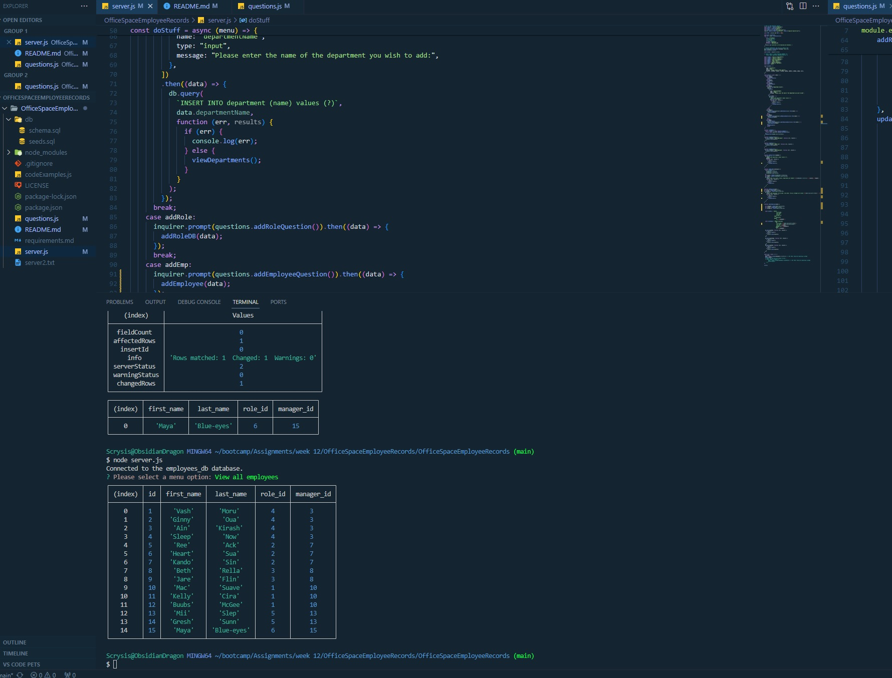

# OfficeSpaceEmployeeRecords
Demo project where we're going to see who forgot their TTPS sheets.

Video link:  https://youtu.be/dGiJ3piwVwY

Welcome to the Office Space Employee Records app!

With this commandline app, you can look up the departments, roles, and employees in your database.

After downloading the repo, open the SECOND OfficeSpaceEmployeeRecords folder (management is sincerely apologetic for the inconvenience),
and run

npm install

.

After that, just run

mysql -u root -p

and then enter in the server password.  Following that, run

source db/schema.sql  

source db/seeds.sql  (if you need to populate your database quickly!).  Do this only
for the initial install.

Now you're ready to run the app!

Type in

node server.js

and the app will start.  Follow the prompts on screen.  We are sorry that at this time, Office Space does not offer 
a looping menu.  We are hard at work on it, though!  You will have to re-run "node server.js" every time you want to use the app.
But do not fret!  The database persists across uses.  Please enjoy!
